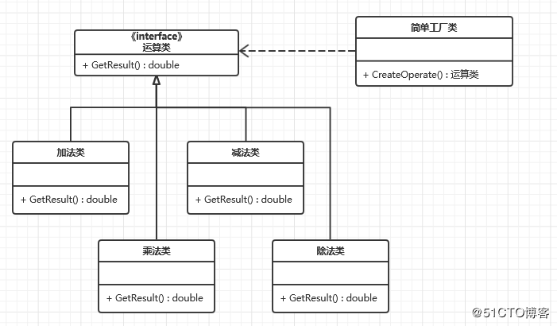

# 工厂方法模式
工厂方法模式的使用频率非常高
    Define an interface for creating an object, but let subclasses decide whice class to instantiate.

#### 通用类图

抽象产品类

产品类

抽象工厂类

工厂类

#### 工厂方法模式的优点
1. 良好的封装性，代码结构清晰，屏蔽对象的创建过程，有利于模块间解耦
2. 工厂方法模式的扩展性非常优秀
   比如要增加一个产品类的时候，只需要增加一个产品类， 拥抱变化
3. 屏蔽产品类，产品类如何变化，调用者不需要关心，
    举个例子 如果使用JDBC连接数据库，现在需要切换 Mysql Oracle,需要改动的地方仅仅是修改一下驱动名称，（灵活性）
4. 典型的解耦框架，只需要与接口接触（符合迪米特法则)，不需要的就不交流（依赖倒置原则），使用产品类的地方使用抽象产品类（里氏替换原则）

#### 工厂方法模式的缺点

#### 工厂方法模式的使用场景
1. *一个类不知道它所需要的对象的类*：在工厂方法模式中，客户端不需要知道具体产品类的类名，只需要知道所对应的工厂即可，具体的产品对象由具体工厂类创建；客户端需要知道创建具体产品的工厂类。
2. *一个类通过其子类来指定创建哪个对象*：在工厂方法模式中，对于抽象工厂类只需要提供一个创建产品的接口，而由其子类来确定具体要创建的对象，利用面向对象的多态性和里氏代换原则，在程序运行时，子类对象将覆盖父类对象，从而使得系统更容易扩展。
3. *将创建对象的任务委托给多个工厂子类中的某一个，客户端在使用时可以无须关心是哪一个工厂子类创建产品子类，需要时再动态指定*，可将具体工厂类的类名存储在**配置文件**或数据库中。

#### 工厂方法模式的扩展
1. 去掉抽象工厂类，并修改一下调用场景类，将工厂方法修改为静态的就成为了 **简单工厂模式**

   简单工厂方法模式扩展困难，不符合开闭原则，单仍然是非常实用的
2. 扩展为多工厂的 工厂方法模式
   创建类职责清晰，而且结构简单
   可扩展性与可维护性有一定的损失(每增加一个产品类，就需要增加一个对应的工厂类，增加了额外的开发量)
   **复杂的场景中一般采用多工厂模式，然后需要增加一个协调类，便面调用者与各个工厂交流，协调类的最用就是屏蔽多个工厂类，对高层模块提供统一的访问接口**
3. 替代单例模式，工厂类通过反射的方式创建 单例对象
4. 延迟初始化(lazy Initialization)

#### 最佳实践  熟能生巧
工厂方法模式咋实际项目中使用的非常广泛。
工厂方法模式经常与其他模式在一起混合使用，如 **模板方法模式  单例模式  原型模式**

