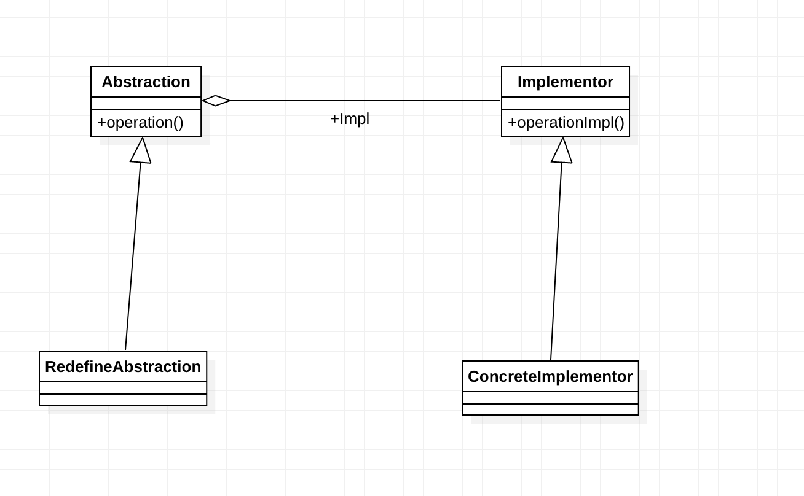

# 桥梁模式

Decouple an abstraction from its implemention, 
so that the two can very independently.



## 角色

1. Abstraction

 抽象化角色，主要职责是定义该角色的主要行为，同时保存一个实现化角色的引用，该角色一般是抽象类
 ```java
 public abstract class Abstraction{
    private Implementor implementor;
    
    public Abstraction (Implementor implementor){
        this.implementor = implementor;
    }
    
    public void request(){
        this.implementor.request();
    }
    public Implementor getImplementor() {
        return implementor;
    }
    
 }
 ```

2. RedefineAbstraction

  引用实现化角色，对抽象化角色进行抽象
  
3. Implementor

  接口或抽象类，定义该角色的行为
  ```java
  public interface Implementor{
    void doSomething();
    void doAnything();
  }
  ```

4. ConcreteImplementor

  实现 实现化角色定义的方法
  
  
桥梁模式是一种非常简单的模式，利用类之间的 继承 聚合 覆写 等常用关系，结构清晰。

##  桥梁模式的应用

### 桥梁模式优点

- 抽象与实现相分离

  桥梁模式的主要特点，也是为了解决继承模式的缺点而提出的，
  该模式下，实现可以不受抽象的月约束，不用绑定在一个固定的抽象层次上。
  
- 优秀的扩充能力

  桥接模式提高了系统的可扩充性，在两个变化维度中任意扩展一个维度，都不需要修改原有系统。 

- 实现细节对客户透明

  用户不用关心细节，抽象层通过聚合关系完成了封装。
  
## 桥梁模式的缺点

 - 桥接模式的引入会增加系统的理解与设计难度，由于聚合关联关系建立在抽象层，要求开发者针对抽象进 
 - 桥接模式要求正确识别出系统中两个独立变化的维度，因此其使用范围具有一定的局限性。

### 桥梁模式 使用场景

- 接口或者抽象类不稳定的情况，明知道接口或者抽象类会变化，还希望使用继承模式来解决问题，得不偿失

- 复用性较高的场景， 代码设计的里的越细，则被重用的几率越高，而采用继承则受父类的限制，不可能有太细的粒度

- 不希望使用继承的场景

### 桥梁模式 注意事项
使用桥梁模式主要的工作就是思考如何将抽象与实现分离。
桥梁模式的理念: 将抽象与实现分离，对变化的封装，尽量把变化封装到力度最小的逻辑单元，避免扩散危险。
党对系统设计时，发现继承有n层，则因该考虑使用桥梁模式。

### 桥梁模式 最佳实践

桥梁模式的精髓就是尽量使用聚合/组合来实现弱关联

桥梁模式描述了类间弱耦合关系，
继承是类间的强耦合关系，父类有某个方法，子类就必须实现

他们有各自的优缺点，对于不同的场景选择使用

对于不经常变化的


