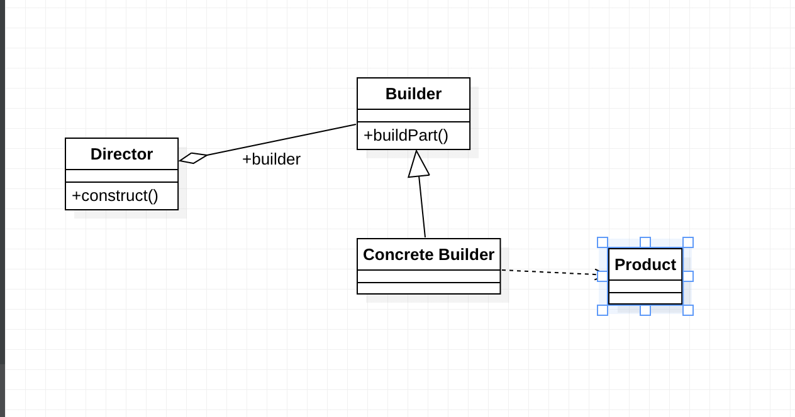

#构建者模式

构建这模式/生成器模式

Separate the construction of a complex object from its representation(表示), so that 
the same construction process can create different representation.

###构建者模式 有如下 四个角色

Product产品类

Builder抽象构建者

Construc Builder 具体构建者

Director 导演类

    封装作用 防止外层类渗透进来

###通用类图

###构建者模式优点

封装性

构建者独立，容易扩展

便于控制细节

###构建这模式缺点

###使用场景

当构造一个对象需要多个可选参数
1. 构造方法参数很长
2. 构造不可变对象
3. 参数之间有依赖，约束关系
4. 构造对象是 参数需要验证  (可以放在build() 里面)

相同的方法不同的执行顺序，得到不同的结果，适合使用构造者模式
多个部件或者零件，都可以装配到一个对象，但产生的结果又不相同时
产品类非常复杂，产品类的调用顺序不同产生不同的效能

###注意
构造者模式与工厂方法模式同为创建模式，但是builer 注重的是 各个组件的构造顺序，这是与工厂方法最大的不同

