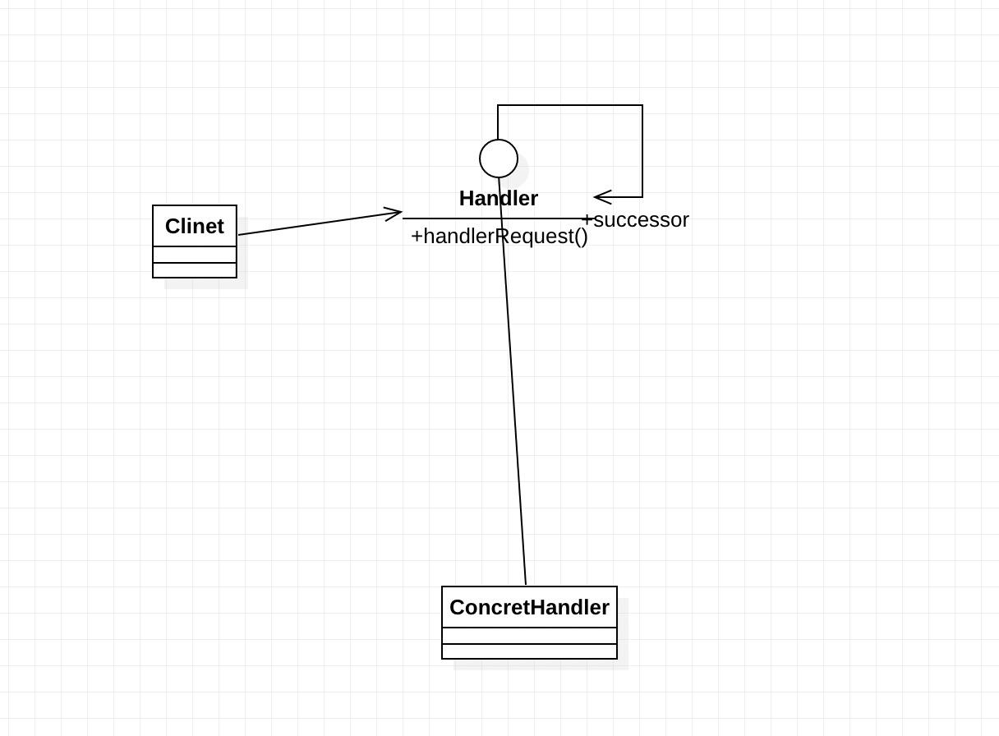

# 责任链模式

> Avoid coupling the sender of a request to its receiver by giving more than one object a chance to handle the request.Chain the receiving objects and pass the request along the chain until an object handles it.
（使多个对象都有机会处理请求，从而避免了请求的发送者和接受者之间的耦合关系。将这些对象连成一条链，并沿着这条链传递该请求，直到有对象处理它为止。）

责任链模式的重点是在“链”上，由一条链去处理相似的请求在链中决定谁来处理这个请求，并返回相应的结果

责任链模式的通用类图如下：



1. 抽象处理者

```java
public abstract class Handler {
     private Handler nextHandler;
     //每个处理者都必须对请求做出处理
     public final Response handleMessage(Request request){
             Response response = null;  
             //判断是否是自己的处理级别
             if(this.getHandlerLevel().equals(request.getRequestLevel())){
                    response = this.echo(request);
             }else{  //不属于自己的处理级别
                    //判断是否有下一个处理者
                    if(this.nextHandler != null){
                            response = this.nextHandler.handleMessage(request);
                    }else{
                            //没有适当的处理者，业务自行处理
                    }
             }
             return response;
     }
     //设置下一个处理者是谁
     public void setNext(Handler _handler){
             this.nextHandler = _handler;
     }
     //每个处理者都有一个处理级别
     protected abstract Level getHandlerLevel();
     //每个处理者都必须实现处理任务
     protected abstract Response echo(Request request);
}
```

2. 具体处理者

在处理者中涉及三个类:
- Level类负责定义请求和处理级别
- Request类负责封装请求
- Response负责封装链中返回的结果
该三个类都需要根据业务产生，读者可以在实际应用中完成相关的业务填充。

```java
public class ConcreteHandler1 extends Handler {
     //定义自己的处理逻辑
     protected Response echo(Request request) {
             //完成处理逻辑
             return null;
     }
     //设置自己的处理级别
     protected Level getHandlerLevel() {
             //设置自己的处理级别
             return null;
     }
}

public class ConcreteHandler2 extends Handler {
     //定义自己的处理逻辑
     protected Response echo(Request request) {
             //完成处理逻辑
             return null;
     }
     //设置自己的处理级别
     protected Level getHandlerLevel() {
             //设置自己的处理级别
             return null;
     }
}

public class ConcreteHandler3 extends Handler {
     //定义自己的处理逻辑
     protected Response echo(Request request) {
             //完成处理逻辑
             return null;
     }
     //设置自己的处理级别
     protected Level getHandlerLevel() {
             //设置自己的处理级别
             return null;
     }
}
```

```java
public class Level {
     //定义一个请求和处理等级
}
public class Request {
     //请求的等级
     public Level getRequestLevel(){
             return null;
     }
}
public class Response {
     //处理者返回的数据
}
```

Client

```java
public class Client {
     public static void main(String[] args) {
         //声明所有的处理节点
         Handler handler1 = new ConcreteHandler1();
         Handler handler2 = new ConcreteHandler2();
         Handler handler3 = new ConcreteHandler3();
         //设置链中的阶段顺序1-->2-->3
         handler1.setNext(handler2);
         handler2.setNext(handler3);
         //提交请求，返回结果
         Response response = handler1.handlerMessage(new Request());
     }
}
```

## 责任链模式的应用

### 责任链模式的优点

责任链模式非常显著的优点是将请求和处理分开。请求者可以不用知道是谁处理的，处理者可以不用知道请求的全貌
（例如在J2EE项目开发中，可以剥离出无状态Bean由责任链处理），两者解耦，提高系统的灵活性。

### 责任链模式的缺点

责任链有两个非常显著的缺点：一是性能问题，每个请求都是从链头遍历到链尾，特别是在链比较长的时候，性能是一个非常大的问题。
二是调试不很方便，特别是链条比较长，环节比较多的时候，由于采用了类似递归的方式，调试的时候逻辑可能比较复杂。

### 责任链模式注意事项

链中节点数量需要控制，避免出现超长链的情况，一般的做法是在Handler中设置一个最大节点数量，
在setNext方法中判断是否已经是超过其阈值，超过则不允许该链建立，避免无意识地破坏系统性能。


## 最佳实践


