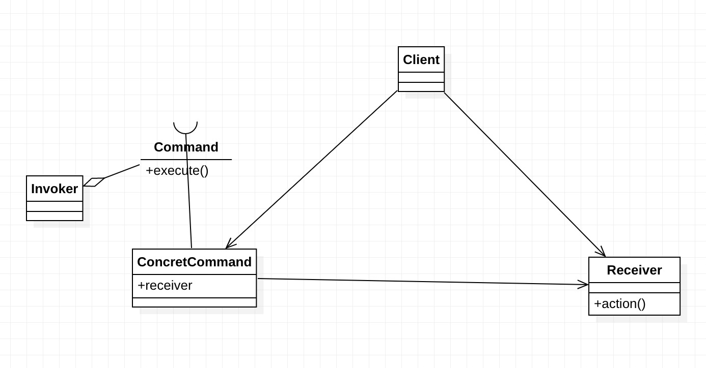

# 命令模式

> Encapsulate a request as an object,hereby letting you 
parameterize clients with different requests, queue or log requests, and support undoable operations.
(将一个请求封装成一个对象，从而让你使用不同的请求把客户端参数化，对请求排队或者记录请求日志，可以提供命令的撤销和恢复功能。)




1. Receiver 接收者角色

该角色就是干活的角色，命令传递到这里是应该被执行的，具体到我们上面的例子中就是Group的三个实现类。
```java
public abstract class Receiver {
     //抽象接收者，定义每个接收者都必须完成的业务
     public abstract void doSomething();
}

public class ConcreteReciver1 extends Receiver{    
     //每个接收者都必须处理一定的业务逻辑
     @Override
     public void doSomething(){
     }
}

public class ConcreteReciver2 extends Receiver{ 
     //每个接收者都必须处理一定的业务逻辑
     @Override
     public void doSomething(){
     }
}
```

2. Command 命令角色

需要执行的所有命令都在这里声明。


```java
public abstract class Command {
     //每个命令类都必须有一个执行命令的方法
     public abstract void execute();
}

public class ConcreteCommand1 extends Command {
     //对哪个Receiver类进行命令处理
     private Receiver receiver; 
     //构造函数传递接收者
     public ConcreteCommand1(Receiver _receiver){
             this.receiver = _receiver;
     }
     //必须实现一个命令
     @Override
     public void execute() {
             //业务处理
             this.receiver.doSomething();
     }
}
public class ConcreteCommand2 extends Command {
     //哪个Receiver类进行命令处理
     private Receiver receiver;
     //构造函数传递接收者
     public ConcreteCommand2(Receiver _receiver){
             this.receiver = _receiver;
     }
     //必须实现一个命令
     @Override
     public void execute() {
             //业务处理
             this.receiver.doSomething();
     }
}
```

3. Invoker 调用者角色

接收到命令，并执行命令。

```java
public class Invoker {
     private Command command;
     //受气包，接受命令
     public void setCommand(Command _command){
             this.command = _command;
     }
     //执行命令
     public void action(){
             this.command.execute();
     }
}
```


Client
```java
public class Client {
     public static void main(String[] args) {
             //首先声明调用者Invoker
             Invoker invoker = new Invoker();
             //定义接收者
             Receiver receiver = new ConcreteReciver1();
             //定义一个发送给接收者的命令
             Command command = new ConcreteCommand1(receiver);
             //把命令交给调用者去执行
             invoker.setCommand(command);
             invoker.action();
     }
}
```


## 命令模式的应用

### 命令模式的优点

- 类间解耦

  调用者角色与接收者角色之间没有任何依赖关系，调用者实现功能时只需调用Command抽象类的execute方法就可以，不需要了解到底是哪个接收者执行。

- 可扩展性

  Command的子类可以非常容易地扩展，而调用者Invoker和高层次的模块Client不产生严重的代码耦合。

- 命令模式结合其他模式会更优秀

  命令模式可以结合责任链模式，实现命令族解析任务；结合模板方法模式，则可以减少Command子类的膨胀问题。

### 命令模式的缺点

如果有N个命令，问题就出来了，Command的子类就可不是几个，而是N个，这个类膨胀得非常大，这个就需要读者在项目中慎重考虑使用。


### 命令模式的使用场景
    
只要你认为是命令的地方就可以采用命令模式，例如，在GUI开发中，一个按钮的点击是一个命令，可以采用命令模式；模拟DOS命令的时候，当然也要采用命令模式；触发－反馈机制的处理等。


## 命令模式的扩展

1. 上面的例子我们还没有说完。想想看，客户要求增加一项需求，那是不是页面也增加，同时功能也要增加呢？

  那这个要怎么修改呢？想想看，很简单的！在AddRequirementCommand类的execute方法中增加对PageGroup和CodePage的调用就可以了
```java
public class AddRequirementCommand extends Command {
     //执行增加一项需求的命令
     public void execute() {
             //找到需求组
             super.regGroup.find();
             //增加一份需求
             super.regGroup.add();
             //页面也要增加
             super.pageGroup.add();
             //功能也要增加
             super.codeGroup.add();
             //给出计划
             super.regGroup.plan();
     }
}
```

2. 反悔问题

客户发出命令，要撤回，怎么办？就类似你使用Ctl+Z组合键（undo功能）? 在任务没有执行完 或者已经执行完成后撤回。

```java
public abstract class Group {
     //甲乙双方分开办公，你要和那个组讨论，你首先要找到这个组
     public abstract void find();
     //被要求增加功能
     public abstract void add();
     //被要求删除功能
     public abstract void delete();
     //被要求修改功能
     public abstract void change();
     //被要求给出所有的变更计划
     public abstract void plan();
     //每个接收者都要对直接执行的任务可以回滚
     public void rollBack(){
             //根据日志进行回滚
     }
}
```

然后就是用Invoker进行调用了，客户选择了执行这个撤销动作，就可以进行撤销操作，
该示意代码确实比较简单，真正实现起来那是异常复杂的，为什么呢？事务日志处理是非常繁琐的处理机制，想想数据库的日志处理吧，你就能想象出这个日志有多复杂！


## 最佳实践

