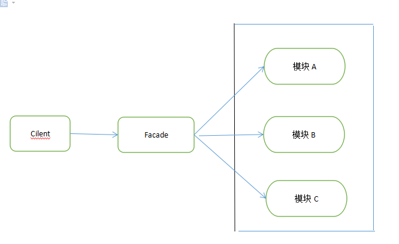

#门面模式(一种常见的封装模式)

Provide a unified interface to a set of interfaces in a subsystem,
Facade defines a interface that makes the subSystem easier to use.

 门面对象 是 所有外部对象访问子系统的唯一接口。
 
 

Facade门面角色
门面角色 了解所有子系统的功能，该角色将所有的客户端的请求委托给子系统，该角色不具有具体的业务逻辑，只是一个委托类。

subSystem 子系统
子系统可以有一或者多个，子系统不知道门面模式的存在。对于子系统而言，facade也是一个客户端。

###优点
1. 减少子系统之间的依赖

2. 提高了灵活性
    
3. 提高安全性

###缺点

1. 不符合开闭原则
门面角色若出现了问题？ 继承 复写 都不顶用， 只能修改门面角色

   
   
###使用场景
1. 为一个复杂的子系统提供一个共外界访问的接口。
2. 子系统相对独立，对于外界相当于是一个黑箱操作。
3. 降低了部分代码对整体代码的影响， 固定只能在某个特定的子系统中进行开发。

### 注意

1. 外观模式与迪米特法则 
  外观模式创造出一个外观对象，将客户端所涉及的属于一个子系统的协作伙伴的数量减到最少，使得客户端与子系统内部的对象的相互作用被外观对象所取代。
  
  外观类充当了客户类与子系统类之间的“第三者”，降低了客户类与子系统类之间的耦合度，外观模式就是实现代码重构以便达到“迪米特法则”要求的一个

强有力的武器。 

2. 抽象外观类的引入 
  外观模式最大的缺点在于违背了“开闭原则”，当增加新的子系统或者移除子系统时需要修改外观类，可以通过引入抽象外观类在一定程度上解决该问题，客户

  端针对抽象外观类进行编程。对于新的业务需求，不修改原有外观类，而对应增加一个新的具体外观类，由新的具体外观类来关联新的子系统对象，同时通过

  修改配置文件来达到不修改源代码并更换外观类的目的。

