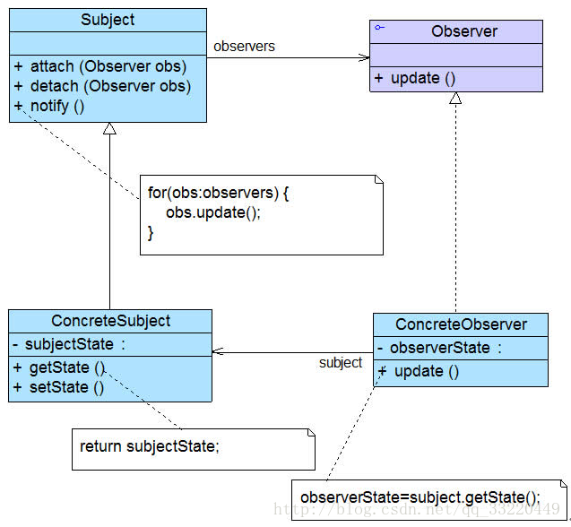

# 观察者模式

又名发布订阅模式，
Define a one-to-many dependency objects, so that when one object changes state,
all its dependents are notified and updated automatically.

####Subject 被观察者
定义被观察者的职责，
必须有三个能力  增加 减少 以及通知 观察者
他是一般抽象类或者实现类，

####Observer 观察者

观察者收到消息后 即进行 update操作，对接收到的消息进行处理

####Concrete Subject

被观察者定义自己的业务逻辑， 同时定义那些事件进行通知

####Concrete Observer

每个观察者收到消息后所作的相应不同，可以定义自己的响应逻辑

##观察者模式优点

1. 观察者与被观察者是抽象耦合
  观察者 与 被观察者都非常容易扩展，而且在java中已经实现了抽象层级的定义。
  
2. 建立一套触发机制
  完成一套触发链

##观察者模式缺点

  对于多个观察者，开发时效率 与 调试的难度加大了。
  
##注意事项
  

