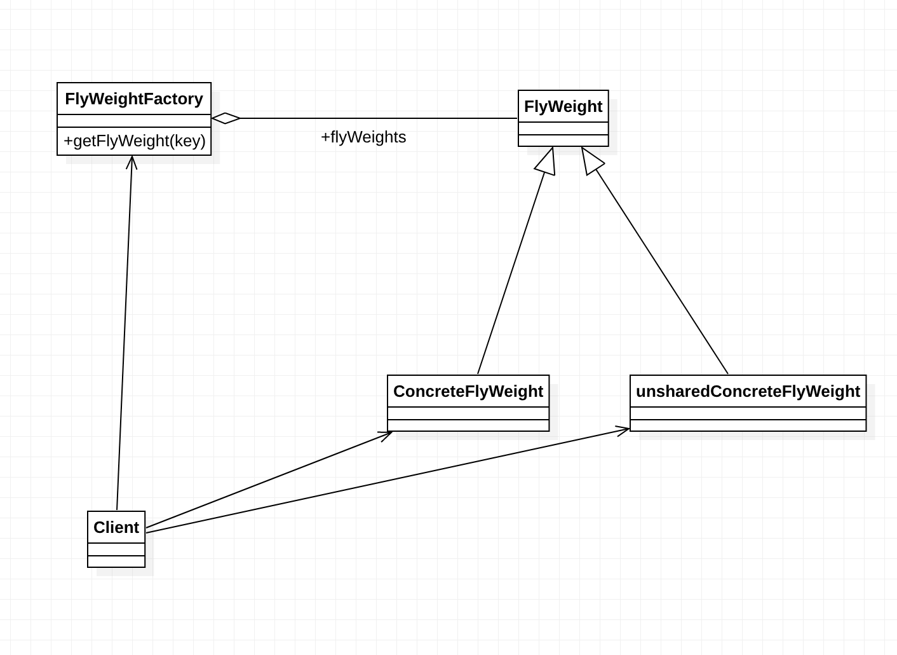

# 享元模式

  享元模式是线程池技术的重要实现方式： 
  Use sharing to support large numbers of fine-gained objects efficiently!
  使用共享对象可以有效地支持大量的细粒度对象。
  
 细粒度对象  共享对象
 
要求细粒度对象就要求，就不可避免的是的对象的数量变多且性质相近。
我们就将这些对象的信息分为两个部分 (内部状态 intrinsic  外部状态extrinsic)

1. intrinsic

 内部状态是对象可以共享出来的数据，存储在享元对象内部且不会改变。
 他们作为一个对象的动态附加信息，不必直接存储在某个具体对象内，属于可以共享的部分

2. extrinsic

 外部状态是对象得以依赖的一个标记，随着环境改变而改变，不可共享。
 


1. FlyWeightFactory

享元工厂，构建一个池容器，并定义一个从池中取对象的方法  
  
2. FlyWeight

抽象享元角色
简单的说就是一个抽象产品类。同时定义了对象的外部状态与内部状态的接口与实现。

3. ConcreteFlyWeight

具体享元角色，具体的一个产品类，改角色中需要注意的是内部状态的修改应该与环境无关，
不能出现一个操作即改变了外部状态又改变了内部状态

4. unshareedConcreteFlyWeight

 不存在外部状态（或者安全要求）不能使用共享状态的对象。 X
 
享元模式的目的在于 ，运用一些技术，使得一些细粒度的对象可以共享，我们的涉及确实也应该这样，多使用细粒度的对象，便于重用或重构。


## 通用源码

```java
//享元抽象类
public abstract class FlyWeight{
    private String intrinsic;
    
    private final String extrinsic;
    
    pubic FlyWeight(String extrinsic){
        this.extrinsic = extrinsic;
    }
    
    public abstract void operate();
    
    //  getter/setter
}
```

```java
//享元工厂
public class FlyWeightFactory{
    public static HashMap<Stirng, FlyWeight> pool = new HashMap();
    
    public static FlyWeightFactory getFlyWeight(String extrinsic) {
        FlyWeight flyWeight = null;
        if (pool.containsKey(extrinsic)){
            flyWeight = pool.get(extrinsic);
        }else{
            flyWeight = new ConcreteFlyWeight(extrinsic);
            pool.put(extrinsic, flyWeight);
        }
        return flyWeight;
    }
}
```

```java
//具体享元对象
public class ConcreteFlyWeight extends FlyWeight{
    
    public ConcreteFlyWeight(String extrinsic){
        super(extrinsic);
    }
    //根据外部状态进行逻辑处理
    public void operate(){
        //todo 进行外部状态的逻辑处理
        // 从而实现外部状态对内部状态的依赖
    }
    
    
}
```

## 享元模式的应用

### 优点

1、享元模式的优点在于它能够极大的减少系统中对象的个数。

2、享元模式由于使用了外部状态，外部状态相对独立，不会影响到内部状态，所以享元模式使得享元对象能够在不同的环境被共享。


### 缺点

1、由于享元模式需要区分外部状态和内部状态，使得应用程序在某种程度上来说更加复杂化了。

2、为了使对象可以共享，享元模式需要将享元对象的状态外部化，而读取外部状态使得运行时间变长。 


## 享元模式的扩展

### 线程安全问题

